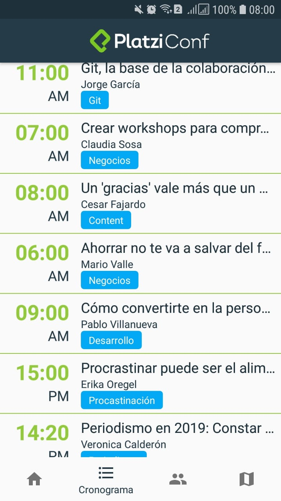
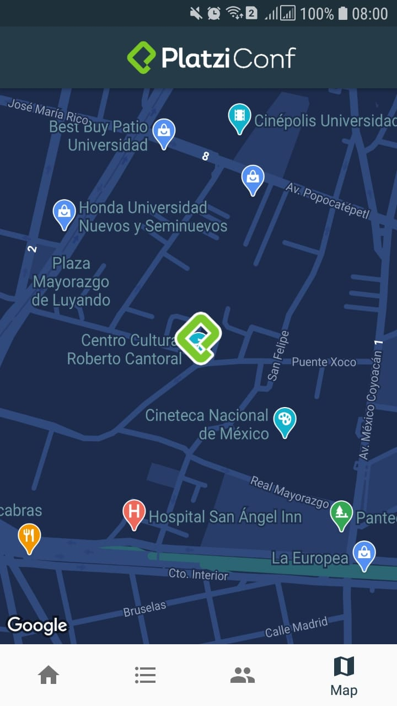

# PlatziConf
This app is made in a course to create an Android app with Kotlin, using an Cloud Firestore and and API to show a map inside our application.
We also use the latest components and libraries from Android Jetpack.

The most likely thing that I learnt was the Navigation Component.

Here is the final result:

-----------------------

